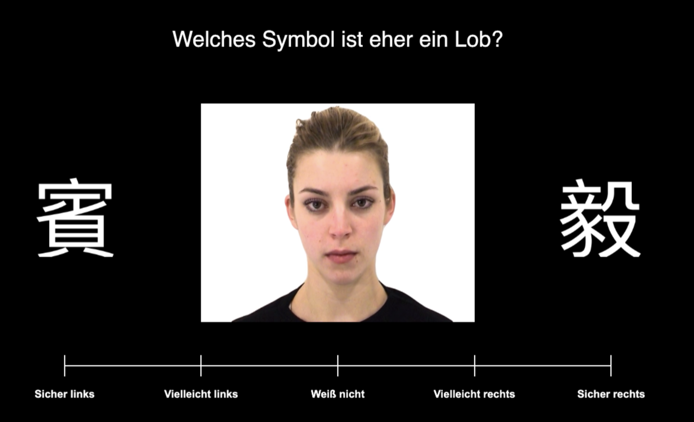

# Social Learning Task

An experiment comparing how people learn from **social** and **non-social**
feedback. On each trial the participant picks one of two symbols and sees what
it produces. The two conditions are structurally identical and differ only in
the outcome: a person reacting, or a pattern changing.

Built in PsychoPy Builder and compiled to JavaScript, so it runs in a browser.
Instructions are in German.

## The task

Two symbols appear left and right. The participant answers with the slider
underneath: direction gives the choice, distance from the centre gives
confidence. Feedback is probabilistic, so the better symbol is the better bet
rather than a guarantee, and the contingency has to be learned over trials.

| | Social | Non-social |
|---|---|---|
| Framing | The symbols stand for words said to a person | The symbols act on a pattern |
| Positive outcome | A happy expression | The pattern lights up in colour |
| Negative outcome | An angry expression | The pattern turns grey and blurred |

Both conditions use video, so motion and timing are matched; only the social
meaning of the outcome differs.

**Structure.** Two training runs introduce the format, one per condition. The
main task is 4 blocks × 6 cycles × 4 trials = 96 trials. Block order is
randomised and then alternates, giving two blocks per condition. Symbols and
stimuli change between blocks, so each block is a new learning problem, and the
side a symbol appears on is re-randomised by cycle. Comprehension checks close
the session.

## Contents

| Path | |
|---|---|
| `RALT_PLD.psyexp` | PsychoPy Builder file — the source of the design |
| `RALT_PLD.js`, `RALT_PLD-legacy-browsers.js` | Compiled builds that run in the browser |
| `index.html` | Page wrapper |
| `trials_*.xlsx`, `trainingtrials_*.xlsx` | Trial lists and reinforcement probabilities |
| `Mandalas_new/`, `kanji/`, `deco/` | Non-social outcome videos, choice symbols, screen furniture |
| `ADFES/` | Social outcome videos — not included, see below |
| `scripts/` | Deployment helpers |

Each session writes one CSV row per trial: the slider response and reaction
time, the stimuli shown, and the block, cycle and trial counters.

## Stimuli

Non-social stimuli were produced for this study. The social stimuli come from
the **Amsterdam Dynamic Facial Expression Set (ADFES)**, which is licensed by
the University of Amsterdam and granted on application; it may not be
redistributed, so the clips are not included here.

## Provenance

Developed at the University of Vienna and used for data collection in 2022. The
`as-run-2022` tag marks the version participants saw; later commits change
instruction wording and documentation only, not the design.
